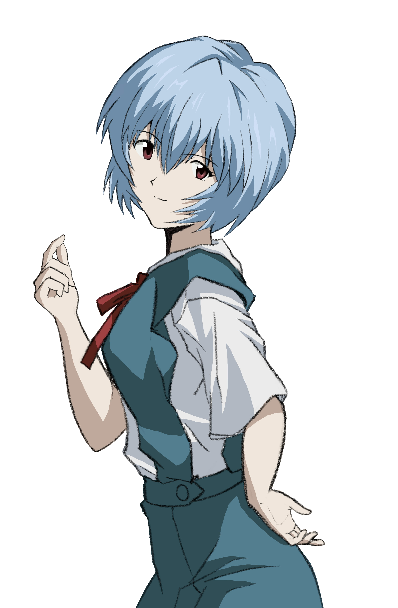

# Image reference
##  anime-anime-girls-rebuild-of-evangelion-neon-genesis-evangelion-super-robot-taisen-hd-wallpaper-7ef4bdf8f94e5212864f85d6df43db09.png
- **Character**: Ayanami Rei 
- **Source**: https://www.wallpaperflare.com/anime-anime-girls-rebuild-of-evangelion-neon-genesis-evangelion-wallpaper-ygzwu
- **Original Credit**: Unknown
- **Edited by**: Chaiyapat Kumtho with die-cut technique using Photoshop CC 2026
##  GSCyPnOagAADXcG.png
- **Character**: Kanade Hisaishi
- **Source**: https://x.com/hibike_euphoINA/status/1810643075892744555/photo/1
- **Original Credit**: Kyoto Animation
- **Edited by**: Chaiyapat Kumtho with crop technique using Photoshop CC 2026
##  asuna_yuuki_render_1_by_lq_luck_by_luki0127_degqyxz-fullview.png
- **Character**: Yuuki Asuna
- **Source**: https://www.deviantart.com/luki0127/art/Asuna-Yuuki-Render-1-by-LQ-Luck-874658663
- **Original Credit**: A-1 Pictures
- **Edited by**: luki0127 @ Deviant Art
##  a6a26c71d98776874a921c84e1059a8d33916af6.png
- **Character**: Mirai Kuriyama
- **Source**: https://ja.gelbooru.com/index.php?page=post&s=list&tags=kyoukai_no_kanata&pid=378
- **Original Credit**: Kyoto Amimation
- **Edited by**: Chaiyapat Kumtho with die-cut technique using Photoshop CC 2026
##  pxfuel.jpg
- **Character**: Kumiko Oumae & Reina Kousaka
- **Source**: https://www.pxfuel.com/en/desktop-wallpaper-vtoks
- **Original Credit**: Kyoto Amimation
## Beside these
The images are use by link `</img src="link">` so, you can inspect the web and follow the link to the original used website.
